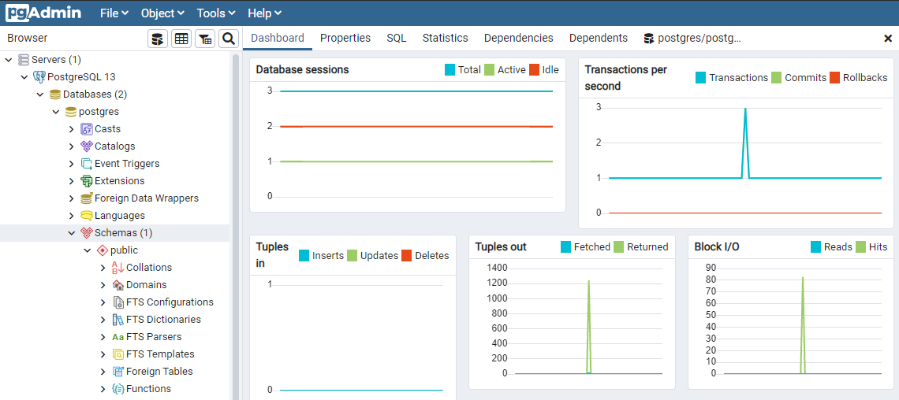
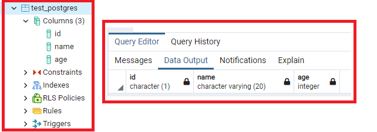

# PostgreSQL 핵심정리

## 목차
[1. 특징](#특징)   
[2. 설치](#설치)   
[3. 환경변수 설정](#환경변수-설정)   
[4. 접속](#접속)   
[5. CRUD](#CRUD)   
[6. 자료형](#자료형)   
[7. 함수](#함수)   
[8. 프로시저](#프로시저)   
[9. 트리거](#트리거)   
[10. 시연](#시연)   
[11. 참고](#참고)   

## 특징
- db blocking
- webflux(reactive)

## 설치
- https://www.postgresql.org/download/windows/

## 환경변수 설정
- 제어판 > 시스템 > 고급 시스템 설정
> 
```
$ psql --version // 버전 조회
```

## 접속
1. SQL Shell(psql)
2. 명령 프롬프트
```
$ psql -U (postgre[name]) // 접속
```
3. pgAdmin4(전용 GUI 툴)
> 
> 
## 구조

## CRUD
1. SQL shell 명령어

| 명령어 | 설명 | 예시코드 |
|---|:---:|---:|
\q | psql 종료 | - |
\l | 데이터베이스 조회 | - |
\c | 입력한 데이터베이스로 이동 | \c [dbName] |
\e | 외부편집기 사용 | - |
\dt | 현재 데이터베이스 테이블 확인 | - |

2. create
> 
> 1) SQL shell에 차례대로 입력 `*구문 오류가 있을 시, 오류 문구가 출력됨`
> 2) \e 명령어 입력
> 3) 외부 편집기로 쿼리 수정 후 저장
> 
> 
> 

## 자료형(데이터타입)
<table>
  <tr>
    <th>이름</th>
    <th>데이터타입</th>
    <th>설명</th>
    <th>예시</th>
  </tr>
  <tr>
    <td rowspan=4>숫자형(Numeric Types)</td>
    <td>INTEGER(INT)</td>
    <td>
      - 소수점 제외 정수</br>
      - 범위 : -2147483648 ~ + 2147483647
    </td>
    <td rowspan=4>
      CREATE TABLE develop_book ( </br>
        book_id NUMERIC(6), </br>
        date    INTEGER, </br>
        name    VARCHAR(80) </br>
      );
    </td>
  </tr>
  <tr>
    <td>NUMERIC(DECIMAL)</td>
    <td>
      - 소수점 포함</br>
      - 정확한 소수점 표현</br>
      - NUMERIC(전체 숫자 자릿수, 소수점 자릿수)</br>
      - 범위 : 0.001 ~ 9.999
    </td>
  </tr>
  <tr>
    <td>FLOAT(REAL, DOUBLE PRECISION)</td>
    <td>부동 소수점 표현(ex. 3.3333...)</td>
  </tr>
  <tr>
    <td>SERIAL</td>
    <td>
      - INTEGER 기본 값으로 1씩 추가</br>
      - 자동으로 값 생성</br>
      - 프라이머리 키 데이터 타입으로 주로 이용
    </td>
  </tr>
</table>

## 참고
- DB
  - https://serverstudy.tistory.com/73
  - https://chrisjune-13837.medium.com/db-lock-%EB%9D%BD%EC%9D%B4%EB%9E%80-%EB%AC%B4%EC%97%87%EC%9D%B8%EA%B0%80-d908296d0279
  - https://nclee.tistory.com/entry/Oracle-DeadLock
  - https://myjamong.tistory.com/181
  - https://estenpark.tistory.com/341
- 포스트그레스큐엘
  - http://www.gurubee.net/lecture/2914
  - https://d2.naver.com/helloworld/227936
  - https://rastalion.me/postgresql%EA%B3%BC-mariadb%EC%9D%98-%EC%82%AC%EC%9D%B4%EC%97%90%EC%84%9C%EC%9D%98-%EC%84%A0%ED%83%9D/
- 오라클 & 포스트그레스큐엘 차이
  - https://kwomy.tistory.com/6?category=851266
  - https://db-engines.com/en/system/Oracle%3BPostgreSQL
  - https://ktdsoss.tistory.com/428
  - https://velog.io/@jisoo1170/Oracle-MySQL-PostgreSQL-%EC%B0%A8%EC%9D%B4%EC%A0%90%EC%9D%80
  - https://stricky.tistory.com/367
  - https://tjdguqdl.tistory.com/6
- 오라클
  - https://ssmsig.tistory.com/37
  - https://bangu4.tistory.com/15
  - https://garimoo.github.io/database/2018/04/16/oracle_db_structure.html
- 오라클 파티셔닝
  - https://m.blog.naver.com/PostView.nhn?blogId=whdahek&logNo=220796458477&proxyReferer=https:%2F%2Fwww.google.com%2F
  - https://umbum.dev/969
- 함수 및 쿼리
  - http://www.gisdeveloper.co.kr/?p=4621
  - https://sungtae-kim.tistory.com/40
  - https://kwomy.tistory.com/9
- WEBFLUX
  - https://warpgate3.tistory.com/entry/Spring-Boot-Reactive-Postgresqlr2dbc
- 설치 및 사용
  - https://dora-guide.com/postgresql-install/
  - https://blog.naver.com/PostView.nhn?blogId=qbxlvnf11&logNo=221491667554&categoryNo=34&parentCategoryNo=0&viewDate=&currentPage=1&postListTopCurrentPage=1&from=postView
- `NodeJS Express + PostgreSQL`
  - https://flaviocopes.com/sequelize/
  - https://velog.io/@eddie_kim/Sequelize-cli%EC%99%80-PostgreSQL%EB%A5%BC-%EC%9D%B4%EC%9A%A9%ED%95%B4%EC%84%9C-%EB%8D%B0%EC%9D%B4%ED%84%B0-Migration-%EB%B0%8F-Seed%ED%95%98%EA%B8%B0
  - https://kentakang.com/136
  - https://www.robinwieruch.de/postgres-express-setup-tutorial
- 그외
  - https://aws.amazon.com/ko/nosql/
  - https://velog.io/@public_danuel/process-env-on-node-js
  - https://www.postgresql.kr/
  - https://db-engines.com/en/ranking
