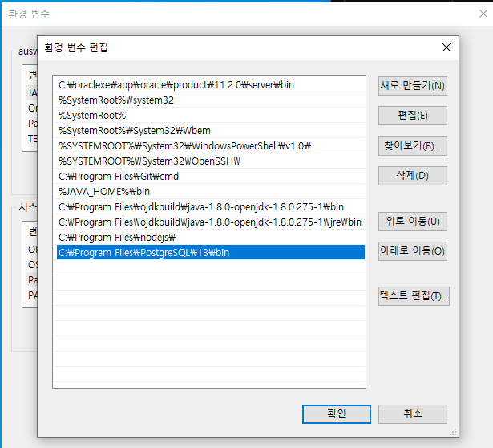
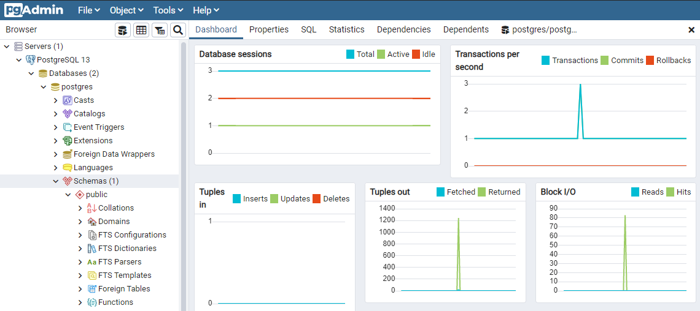
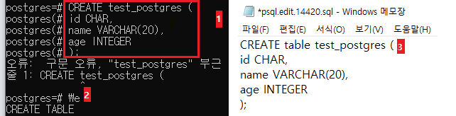
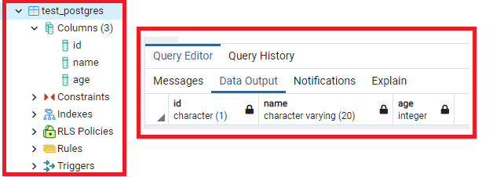

# PostgreSQL 핵심정리
## 목차
[1. 특징](#특징)

[2. 설치](#설치)

[3. 환경변수 설정](#환경변수-설정)

[4. 접속](#접속)

[5. CRUD](#CRUD)

[6. 자료형](#자료형)

[7. 함수](#함수)

[8. 프로시저](#프로시저)

[9. 트리거](#트리거)

[10. 시연](#시연)
## 특징
- db blocking
- webflux(reactive)
## 설치
- https://www.postgresql.org/download/windows/
## 환경변수 설정
- 제어판 > 시스템 > 고급 시스템 설정
> 
```
$ psql --version // 버전 조회
```
## 접속
1. SQL Shell(psql)
2. 명령 프롬프트
```
$ psql -U (postgre[name]) // 접속
```
3. pgAdmin4(전용 GUI 툴)
> 
## 구조

## CRUD
1. SQL shell 명령어

| 명령어 | 설명 | 예시코드 |
|---|:---:|---:|
\q | psql 종료 | - |
\l | 데이터베이스 조회 | - |
\c | 입력한 데이터베이스로 이동 | \c [dbName] |
\e | 외부편집기 사용 | - |
\dt | 현재 데이터베이스 테이블 확인 | - |

2. create
> 
> 1) SQL shell에 차례대로 입력 `*구문 오류가 있을 시, 오류 문구가 출력됨`
> 2) \e 명령어 입력
> 3) 외부 편집기로 쿼리 수정 후 저장
> 
> 
> 

## 자료형(데이터타입)
<table>
  <tr>
    <th>이름</th>
    <th>데이터타입</th>
    <th>설명</th>
    <th>예시</th>
  </tr>
  <tr><td>숫자형(Numeric Types)</td></tr>
  <tr><td>화폐형(Monetary Types)</td></tr>
  <tr><td>문자형(Character Types)</td></tr>
  <tr><td>날짜 및 시간(Date & Time)</td></tr>
  <tr><td>불리언형(Boolean Types)</td></tr>
  <tr><td>배열형(Array Types)</td></tr>
  <tr><td>제이슨형(Json Types)</td></tr>
</table>


|이름|데이터타입|설명|예시
|---|:---:|---:|
숫자형(Numeric Types)|INTEGER(INT)(소수점 제외 정수), SMALLINT(소수점 포함), BINGINT, NUMERIC|숫자의 형태로 저장|
화폐형(Monetary Types)|
문자형(Character Types)|
날짜 및 시간(Date & Time)|
불리언형(Boolean Types)|
배열형(Array Types)|
제이슨형(Json Types)|


## 함수
## 프로시저
## 시연
